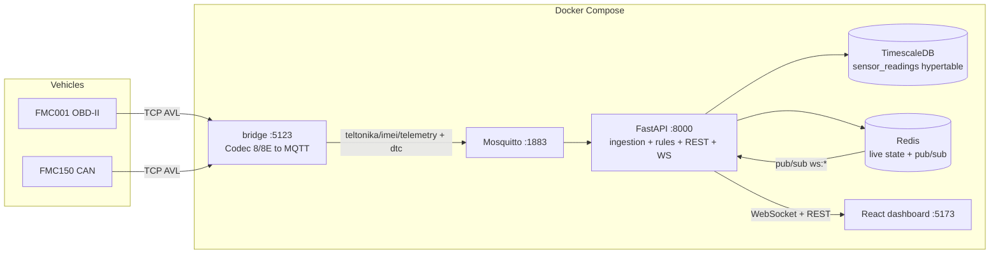

# PREDICT — Enhancement Plan

Comprehensive plan to improve performance, fix bugs, complete the feature set, and prepare the platform for driver-behavior analytics and predictive maintenance.

**Scope constraints (unchanged):** single tenant, no login/auth, real Teltonika hardware (FMC001 OBD-II / FMC150 CAN), Docker Compose stack (FastAPI + TimescaleDB + Redis + Mosquitto + React/Vite).

---

## 1. Executive summary

The stack is architecturally sound: `tracker → bridge (Codec 8E) → MQTT → FastAPI ingestion → TimescaleDB/Redis → rule engine → WebSocket → React`. Multi-vehicle registration already works end-to-end. The main problems are:

1. **Correctness bugs** — a WebSocket buffer bug that silently kills live dashboard updates after 100 messages, Redis live-state overwrites that "lose" sensors, dormant seeded rules that can never fire, vehicles that stay GREEN forever after going offline, and FK-violation 500s on deletes.
2. **Performance debt** — N+1 queries on every list endpoint, 10 COUNT queries per dashboard summary, the rule set re-queried from the DB on every telemetry message, per-second full-page re-renders in React, no TimescaleDB retention/compression/aggregates.
3. **Feature gaps** — rules/thresholds are read-only in the UI, sensor history is capped at 1 hour, no full vehicle history view, no driver-behavior or predictive-maintenance features despite the data being available.

The plan is organized in 6 phases. Phases 1–3 (bugs, backend perf, frontend perf/UX) make the existing product solid. Phases 4–6 (history, driver behavior, predictive maintenance) build the new capabilities on top.

---

## 2. Current architecture (verified)

### Answers to the key questions

- **Can I register multiple vehicles and read all their sensor readings on the dashboard?** Yes — this works today. Vehicles are registered by unique IMEI (`POST /api/v1/assets/vehicles/register`, Assets UI), provisioned with a per-model sensor catalog (`backend/app/services/provisioning.py`), and `GET /api/v1/dashboard/fleet/live` returns **all active vehicles with all sensors, thresholds and rules in one request**. The dashboard stacks one telemetry card per vehicle. Caveats fixed by this plan: live updates stall after 100 WS messages (bug 4.1), partial AVL records blank out sensor tiles (bug 4.2), and with many vehicles the single-column card stack and 1 Hz re-render will not scale (Phase 3).
- **Are the trigger rules/thresholds correct?** The engine works (threshold + DTC, duration, dedupe, shadow mode) but has real problems: three seeded rules can never fire because their `sensor_type` doesn't match what provisioning creates, `Rule.sensor_id` is silently ignored (all rules are global), the sustained-duration logic resets whenever a record omits the sensor, and there is no UI to create/edit rules or thresholds. See section 6.
- **Can we see the entire vehicle/sensor history?** Not today. Sensor history is hardcoded to the last 1 hour in a drawer; maintenance history is an unpaginated list. Phase 4 adds a full history experience backed by TimescaleDB continuous aggregates.

---

## 3. Phase overview

| Phase | Theme | Outcome |
|-------|-------|---------|
| 1 | Bug fixes (correctness) | Live dashboard reliable, rules actually fire, no 500s |
| 2 | Backend performance & data lifecycle | Sub-100 ms list endpoints, bounded ingestion, retention |
| 3 | Frontend performance & UX cleanup | Clean, memoized, scalable dashboard; rules/threshold UI |
| 4 | Full vehicle & sensor history | Range-picker charts, aggregates, alert + maintenance timeline |
| 5 | Driver behavior analytics | Trips, driving events, per-vehicle driving score |
| 6 | Predictive maintenance foundation | Scheduled rules, baselines/anomaly detection, ML-ready data |

---

## 4. Phase 1 — Bug fixes (priority ordered)

### P0 — breaks core functionality

**4.1 Live updates stall after 100 WebSocket messages**
`frontend/src/App.tsx` caps the buffer with `setWsMessages(prev => [...prev.slice(-99), msg])` while every page tracks its position with `lastWsIdx.current = wsMessages.length` (`DashboardPage.tsx` lines 119–138, same pattern in Assets/Alerts/WorkOrders). Once 100 messages have arrived the array length stays pinned at 100, `for (i = 100; i < 100)` never runs, and **all live patching silently stops** (masked only by the 15 s poll). At one record per 10 s per vehicle this takes minutes to hit.
**Fix:** replace the growing-array prop with a subscription API — extend `useWebSocket` to a context provider exposing `subscribe(channel, handler)`; pages register handlers and receive each message exactly once. Deletes the `wsMessages` prop drilling and the index bookkeeping entirely.

**4.2 Redis live state overwritten by partial records**
`_handle_telemetry` builds the snapshot only from the sensors present in the current MQTT message and `set_vehicle_state` replaces the whole key (`backend/app/ingestion/mqtt_service.py` lines 151–162, `redis_client.py` lines 26–29). Teltonika records legitimately omit IO elements, so tiles flip to "offline" until the next full record.
**Fix:** merge into the existing snapshot (read-modify-write per vehicle, keep a per-sensor `timestamp` so staleness is judged per sensor, not per snapshot) and set a TTL (e.g. 24 h). Update `/dashboard/fleet/live` `_is_state_live` to use per-sensor freshness.

**4.3 Vehicles never go offline (stuck GREEN)**
Health only changes on first data (GREY→GREEN in ingestion) or on alert transitions (`services/health.py`). When a tracker stops sending, `last_seen` freezes but health stays GREEN forever.
**Fix:** add an asyncio background watchdog task in `main.py` lifespan (every 60 s): vehicles with `last_seen` older than `TELEMETRY_LIVE_MAX_AGE_SECONDS` and no active alerts → GREY, publish `ws:health`. `recompute_health` should treat "stale `last_seen`" as GREY too.

**4.4 Dormant seeded rules (can never fire)**
- `tire_pressure_fl` rule seeded (`init_db.py` line 90) but provisioning never creates tire-pressure sensors and neither AVL map emits that `sensor_type` → dead rule.
- `control_module_voltage` rule only matches FMC001; FMC150 publishes `vehicle_battery_voltage` — dormant on CAN vehicles.
- `battery_voltage` (AVL 66 = external tracker supply) rule at `< 11.5 V` is correct for FMC001 but review against FMC150's separate `vehicle_battery_voltage`.
**Fix:** audit `SEED_RULES` against both `bridge/avl_map.*.json` files and `provisioning.py`; delete the tire rule (or map the IO if the hardware supports it), add an FMC150 twin for the voltage rules. Add a startup log warning listing active rules whose `sensor_type` matches no provisioned sensor (also surface this on the Rules page as a "dormant" badge).

**4.5 Deletes crash with FK violations (HTTP 500)**
`DELETE /assets/vehicles/{id}` fails once the vehicle has `sensor_readings`/`alerts`/`work_orders` rows (no `ondelete` on FKs, no ORM cascade on those relationships). Same class of failure: deleting fleets (ORM cascades into vehicles), rules with alerts, templates with rules, work orders referenced by `alerts.work_order_id`.
**Fix:** decide per entity — vehicles: soft-delete (`is_active=False`) as the default UI action plus an explicit hard-delete that first purges readings/alerts/WOs in a transaction; rules/templates: `SET NULL` on dependent FKs (`alerts.rule_id`, `rules.work_order_template_id`); work orders: block delete when referenced, or null out `alerts.work_order_id` first. Add the matching `ondelete=` clauses to `models.py` and a small idempotent migration in `init_db.py`.

### P1 — wrong behavior, visible to users

**4.6 Sustained-duration rules reset on sparse records**
`evaluate_telemetry` resets the duration timer whenever the sensor is absent from a record (`rules/engine.py` lines 223–227). Since AVL records don't always carry every IO element, a genuinely sustained condition (e.g. coolant > 110 °C for 300 s) can be reset repeatedly and never fire.
**Fix:** only reset when the sensor is present with a non-violating value; treat "sensor absent" as "no information" (keep the timer, optionally expire it via a TTL of ~3× the send period). Also add a TTL to the `rule:{id}:vehicle:{vid}:since` keys (they currently leak forever, engine lines 87–89).

**4.7 Acknowledging an alert clears the health color**
`recompute_health` counts only `ACTIVE` alerts (`services/health.py` lines 21–27) while alert dedupe treats ACKNOWLEDGED as still open. Acknowledge = "I've seen it", not "it's fixed" — the vehicle should stay RED/YELLOW.
**Fix:** include `ACKNOWLEDGED` in the health severity scan.

**4.8 Shadow-mode flag inconsistent across restarts**
`/dashboard/summary` and `/health` return `settings.SHADOW_MODE` (env value, mutated at runtime by the toggle) while the source of truth is the `system_config` row. After a backend restart the badge shows the env default even if the DB says otherwise.
**Fix:** read shadow mode from `SystemConfig` everywhere (cache in memory, invalidate on toggle); stop mutating `settings`.

**4.9 Ingestion defaults `ignition` to `True`**
`data.get("ignition", True)` (`mqtt_service.py` line 102) marks records without the ignition meta as engine-on, polluting stored readings and future idling/trip analytics. **Fix:** default to `None` and store nullable.

**4.10 Rule targeting ignores `Rule.sensor_id`**
The engine matches on `sensor_type` only (`engine.py` lines 214–221), so a rule created for one vehicle's sensor applies to the whole fleet, silently. **Fix (minimal, keeps single-tenant simplicity):** add optional `vehicle_id` to `Rule`; when set, skip other vehicles during evaluation. Honor it in the Rules UI (Phase 3) and in `/fleet/live` rule display. Drop or implement `sensor_id` targeting — don't leave it half-wired.

**4.11 Float equality operator**
`"==": lambda v, t: v == t` (`engine.py` line 41) is near-useless for float telemetry. Replace with tolerance comparison (`abs(v - t) <= epsilon`) or remove `==` from the UI options.

**4.12 API error rendering — `[object Object]`**
`client.ts` lines 52–54 assume `detail` is a string; FastAPI 422 validation errors return an array → registration modal shows `[object Object]`. **Fix:** normalize (join `detail[].msg`) in one place in the client.

### P2 — polish / dead code

- `api.getHealth()` calls `/api/v1/health` which doesn't exist (`client.ts` lines 220–224) — fix path or delete (currently unused).
- Remove unused client methods (`getFleetHealth`, `getVehicleLatest`, `getMaintenanceHistory`) or wire them up in Phase 4; remove unused `selectinload` import (`assets.py` line 10), `PaginatedOut` schema, and unused deps (`alembic` or adopt it properly, `orjson`, `httpx`, `psycopg2-binary`, `email-validator`) from `backend/requirements.txt`.
- Work-order alert link goes to bare `/alerts` (`WorkOrdersPage.tsx` lines 221–224) — deep-link `/alerts?highlight={id}` and auto-scroll/highlight.
- Missing `/favicon.svg` (referenced in `index.html`); Inter font declared in `index.css` but never loaded — add the font file/link or drop the declaration.
- `resolve_alert`/`suppress` allow any state transition (`alerts.py`) — guard like `acknowledge` does.
- `sensorIcons` map is dead code and its keys mismatch catalog types (`oil_pressure` vs `engine_oil_pressure`) — wire icons into `SensorTile` with corrected keys (Phase 3) or delete.
- Circular FK `alerts.work_order_id` ↔ `work_orders.alert_id` — declare `use_alter=True` on one side so `create_all` on a fresh DB is deterministic.

---

## 5. Phase 2 — Backend performance & data lifecycle

### 5.1 Kill N+1 queries (biggest win per line changed)

| Endpoint | Today | Fix |
|----------|-------|-----|
| `GET /assets/vehicles` | 1 + 4×N queries (`_vehicle_to_out` per vehicle: fleet name, component count, alert count, WO count) | One query joining `Fleet.name` + three grouped-count subqueries keyed by `vehicle_id`, merged in Python |
| `GET /alerts`, `GET /workorders` | vehicle-name query per row (up to 100) | `JOIN vehicles` and select `Vehicle.name` in the list query |
| `GET /assets/fleets`, `/vehicles/{id}/components` | count query per row | grouped counts |
| `GET /dashboard/health` | per-vehicle alert + WO count in a loop | reuse the grouped-count approach `/fleet/live` already uses — or delete the endpoint (frontend doesn't use it) |
| `GET /dashboard/summary` | 10 sequential COUNTs | 3 queries with `count(*) FILTER (WHERE ...)` (one over vehicles, one over alerts, one over work orders) |

### 5.2 Ingestion hot path

- **Cache the rule set.** `evaluate_telemetry` re-queries all active threshold rules and the vehicle row on every message (`engine.py` lines 207–217). Cache rules in-process with a short TTL (30 s) or explicit invalidation from the rules CRUD endpoints (publish `rules:changed` on Redis, all workers listen). Pass the vehicle name from ingestion instead of re-querying.
- **Reuse one DB session per message.** Ingestion opens a session, then the rule engine opens a second one; pass the session through.
- **Bound MQTT → asyncio concurrency.** `on_message` fires `run_coroutine_threadsafe` per message with no limit (`mqtt_service.py` lines 54–59); a device flushing a multi-hour buffer creates hundreds of concurrent sessions. Replace with an `asyncio.Queue(maxsize≈1000)` + a small worker pool (2–4 consumers) so bursts are processed in order per device with backpressure.
- **Batch inserts.** `session.add()` per reading is fine at 1 vehicle / 10 s, but with the queue in place, insert each message's readings via a single `insert().values([...])` executemany.

### 5.3 TimescaleDB lifecycle (currently unbounded growth)

Add to `init_db.py` (idempotent, guarded like the hypertable creation):

- **Compression:** `ALTER TABLE sensor_readings SET (timescaledb.compress, timescaledb.compress_segmentby = 'vehicle_id, sensor_type')` + `add_compression_policy('sensor_readings', INTERVAL '7 days')`.
- **Retention:** `add_retention_policy('sensor_readings', INTERVAL '365 days')` (configurable via env `READINGS_RETENTION_DAYS`).
- **Continuous aggregates** (feeds Phase 4 history and Phase 6 baselines):
  - `sensor_readings_1m` — `time_bucket('1 minute')`, avg/min/max/count per (vehicle_id, sensor_type).
  - `sensor_readings_1h` — same at 1 hour, with refresh policies.

### 5.4 Misc backend

- Pagination + `limit` on `GET /system/history*` (currently unbounded).
- `GET /dashboard/vehicles/{id}/readings`: serve raw rows only for windows ≤ 6 h; larger windows read from the 1m/1h aggregates (new `resolution` query param, auto-selected).
- Idempotent ingestion (optional hardening): MQTT QoS 1 can redeliver; a unique partial index on `(vehicle_id, sensor_type, timestamp)` with `ON CONFLICT DO NOTHING` prevents duplicate rows during bridge retries/replays.

---

## 6. Trigger rules & thresholds — audit and completion

### 6.1 Engine fixes (from Phase 1)

Dormant-rule audit (4.4), duration-reset fix (4.6), acknowledged-health fix (4.7), optional `vehicle_id` targeting (4.10), float `==` (4.11).

### 6.2 Two-layer threshold model — make it explicit

Today there are two disconnected threshold systems that confuse users:

1. `Sensor.warning_threshold` / `critical_threshold` → **tile coloring only** (`/fleet/live` `_sensor_status`).
2. `Rule` rows → **alerts + work orders**.

Plan: keep both layers but (a) document the distinction in the UI ("display thresholds" vs "alert rules"), (b) show both on the sensor drawer (already done) and on the new Rules page, and (c) add a one-click "create rule from thresholds" action so the layers can be kept in sync intentionally.

### 6.3 Rules management UI (Rules page becomes read-write)

- Full CRUD against the existing `POST/PATCH/DELETE /api/v1/rules` endpoints (backend already complete; frontend client needs `createRule`/`updateRule`/`deleteRule`).
- Form: name, sensor_type (dropdown sourced from the telemetry catalog + provisioned sensor types, so you can't create dormant rules by typo), operator, threshold, sustained duration, severity, WO template, active toggle, optional vehicle scope.
- Enable/disable toggle per rule row; "dormant" badge when `sensor_type` matches no provisioned sensor.
- Sensor threshold editing on the Assets page (uses existing `PATCH /assets/sensors/{id}`).

---

## 7. Phase 3 — Frontend performance & UX cleanup

### 7.1 Performance

- **WebSocket context** (fix 4.1): `WsProvider` with `subscribe(channel, cb)`; pages/components subscribe to exactly what they need. Telemetry patches go straight to the affected vehicle card via a per-vehicle store slice, not through App-level state.
- **Stop the 1 Hz full-page re-render:** `setNow` every second re-renders every card and tile (`DashboardPage.tsx` lines 79–82). Move relative-time display into a tiny `<RelativeTime>` leaf component with its own 1 s timer (or 5 s), and `React.memo` `VehicleTelemetryCard` + `SensorTile` with stable props.
- **Adopt TanStack React Query** for all REST data: dedupes the poll+WS refetch storm, gives cache invalidation (`queryClient.invalidateQueries` on WS events instead of the hand-rolled 1.5 s debounce timers), retries, and loading/error states for free. Polling intervals become `refetchInterval` and can be relaxed (dashboard 30 s) since WS is the primary update path.
- **Fetch the telemetry catalog once** (it's static per build) instead of every 15 s.
- **Silent caps:** Alerts page passes no `skip/limit` (backend caps at 100) — add "load more" pagination; same for work orders.

### 7.2 UX / cleanliness

- **Dashboard**: add a filter/search bar (by name/plate/health) and a compact-grid toggle so 10+ vehicles stay scannable; keep the health-sorted order; add per-vehicle "view details" link (Phase 4 page).
- **Sensor drawer**: subscribe to live WS updates so the chart and current value tick while open; add range switch (1h/6h/24h — Phase 4 endpoint).
- **Alerts**: deep-link + highlight support (`/alerts?highlight=id`); show vehicle chips; suppress action (backend exists, no UI).
- **Work orders**: replace hardcoded `tech1` with a technician picker fed by a small `GET /api/v1/users` endpoint (users are already seeded; still no auth — it's just a name picker).
- **Consistency**: one loading-skeleton pattern everywhere; use `predict-*` palette tokens in `TelemetryCatalogPanel`; distinct icon for Rules nav (e.g. `SlidersHorizontal`), reserving `Settings` for a future settings page; add `favicon.svg`; load Inter or drop it; responsive sidebar collapse for narrow screens; 404 catch-all route.
- Wire `sensorIcon()` into tiles with corrected keys, or delete it.

---

## 8. Phase 4 — Entire vehicle & sensor history

### 8.1 Backend

- `GET /api/v1/dashboard/vehicles/{id}/readings` gains `from`/`to`/`resolution` (`raw|1m|1h|auto`); `auto` picks raw ≤ 6 h, 1m ≤ 7 d, 1h beyond — served from the continuous aggregates (5.3), returning `avg/min/max` per bucket so charts can render bands.
- New `GET /api/v1/vehicles/{id}/timeline` — merged, paginated event stream for one vehicle: alerts (all statuses), work orders, maintenance history, DTC events, health transitions. Backed by the existing tables; health transitions need a small `vehicle_health_events` log table written by `recompute_health` and the offline watchdog.
- Alerts/WOs endpoints already filter by `vehicle_id` — used by the detail page.
- CSV export endpoint for readings (`Accept: text/csv` or `?format=csv`) for offline analysis.

### 8.2 Frontend — Vehicle detail page (`/vehicles/:id`)

New route, linked from dashboard cards and the Assets list:

- **Overview header**: health, last seen, ignition, device info, active alert/WO counts.
- **History tab**: multi-sensor chart with range picker (1h / 24h / 7d / 30d / custom), sensor multi-select overlay, threshold reference lines, min/avg/max bands from aggregate buckets, CSV export. Recharts stays adequate at ≤ ~2000 points per series thanks to server-side bucketing.
- **Timeline tab**: the merged event stream (alerts, work orders, maintenance, DTCs, health changes) with severity coloring and deep links.
- **Assets tab**: the existing component → sensor drill-down plus threshold editing (6.3).

The 1-hour drawer stays as the quick view; its "Last 60 minutes" header gains the range switch and a "Full history →" link to this page.

---

## 9. Phase 5 — Driver / driving behavior analytics

All inputs already flow through the pipeline: GPS position + speed per record, `vehicle_speed`, `engine_rpm`, `engine_load`, `ignition`, `movement`, odometer, fuel level, timestamps at ~10 s cadence.

### 9.1 Two-tier event detection

- **Tier 1 — device-native events (preferred, accurate):** Teltonika eco-driving IO elements (harsh acceleration / braking / cornering — e.g. AVL 253 "Green driving type" + 254 "Green driving value", overspeeding event 255) are computed on-device from the accelerometer. Add them to `bridge/avl_map.*.json` as `kind: "event"`, publish on a new `teltonika/{imei}/event` topic, and enable the IOs in the tracker config (documented in README SMS/Configurator steps).
- **Tier 2 — server-side derivation (works with current data, no reconfiguration):** a `behavior` service processing each vehicle's readings stream:
  - *Harsh acceleration/braking*: Δspeed/Δt between consecutive GPS/CAN speed samples beyond thresholds (e.g. |a| > 3 m/s²) — coarse at 10 s sampling, flagged as "estimated".
  - *Speeding*: `vehicle_speed` above a configurable fleet limit for N consecutive samples.
  - *High-RPM driving*: ratio of samples with `engine_rpm` above threshold while moving.
  - *Excessive idling*: `ignition = on` and `speed ≈ 0` for > N minutes.

### 9.2 Data model

- `trips` — `id, vehicle_id, start_ts, end_ts, start/end odometer, distance_km, duration, max_speed, avg_speed, fuel_start/end, idle_seconds`. Trip boundaries from ignition transitions (fallback: movement + speed gap > 5 min). Built incrementally by the ingestion pipeline (state machine per vehicle in Redis).
- `driving_events` — `id, vehicle_id, trip_id, ts, event_type (harsh_accel|harsh_brake|harsh_corner|speeding|idling|high_rpm), value, latitude, longitude, source (device|derived)`.
- `driver_scores` — daily rollup per vehicle: `date, vehicle_id, trips, distance_km, events per 100 km by type, idle_ratio, score (0–100)`. Score = weighted penalty model, weights configurable in `system_config`. (Single tenant, no login → score is per **vehicle**, standing in for the driver; a `drivers` table can be added later without schema conflict.)

### 9.3 API + UI

- `GET /api/v1/behavior/summary` (fleet scorecards), `GET /api/v1/behavior/vehicles/{id}` (score trend, event breakdown), `GET /api/v1/behavior/vehicles/{id}/trips` (+ trip detail with events).
- New **Driving** page: fleet scorecard grid (score badge per vehicle, worst offenders first), per-vehicle drill-in with score trend chart, event-type breakdown, trip list; events also merged into the Phase 4 vehicle timeline.
- Optional: behavior-based rules ("more than 5 harsh-brake events per day → warning alert") — reuses the existing rule engine with a new `rule_type = BEHAVIOR`.

---

## 10. Phase 6 — Predictive maintenance foundation

Build in three steps, each independently useful; no ML until the data supports it.

### 10.1 Implement the `SCHEDULED` rule type (immediate, real PdM value)

`RuleType.SCHEDULED` exists in the enum and schemas but has **no evaluator**. Implement it: interval on `odometer` or engine-hours (`interval_value` km/h units), tracked per vehicle against the last matching `maintenance_history` event; fires a work order when the interval is due. Combined with the existing `distance_until_service` threshold rules, this covers classical scheduled maintenance.

### 10.2 Baselines & anomaly detection (statistical, from the 1h aggregates)

A nightly job (asyncio task or `scripts/` cron) computes per-vehicle, per-sensor baselines from `sensor_readings_1h` and writes `sensor_baselines (vehicle_id, sensor_type, window, mean, std, p95, updated_at)`. Detection examples with current sensors:

- **Battery/charging degradation**: declining `battery_voltage` / `control_module_voltage` trend at ignition-on vs 30-day baseline → "battery failing" alert weeks before a no-start.
- **Cooling system drift**: coolant warm-up time (samples from ignition-on until 80 °C) trending up, or steady-state temperature creeping toward threshold → thermostat/radiator warning before the 110 °C rule fires.
- **Fuel anomaly**: L/100 km per trip (fuel deltas + odometer from Phase 5 trips) vs baseline → injector/filter issues or fuel theft.
- Generic z-score rule: sustained deviation > 3σ from the sensor's own baseline → INFO alert ("abnormal for this vehicle" even when inside global thresholds).

Surfaced as a new alert source (`rule_type = ANOMALY`, auto-generated rules) so the existing alert → work order → maintenance-history loop is reused unchanged.

### 10.3 ML readiness (deliberately later)

Supervised failure prediction needs labels the system is only now starting to collect. This phase just guarantees the data will be there:

- Labels: enforce structured `maintenance_history.event_type` + component field on WO completion (small UI change).
- Features: retained raw readings (1 yr), 1m/1h aggregates, trips, driving events, DTC history.
- When enough failure events exist (realistically after months of fleet operation), train per-component survival/classification models offline (notebook first), serve as a scoring job writing `component_risk` scores shown on the vehicle detail page. Out of scope to implement now; the schema and retention decisions above are what make it possible.

---

## 11. Implementation order & file map

| Step | Files touched (primary) |
|------|-------------------------|
| 1. WS context + stall fix (4.1) | `frontend/src/hooks/useWebSocket.ts`, `App.tsx`, all pages |
| 2. Redis merge + TTL (4.2) | `backend/app/ingestion/mqtt_service.py`, `db/redis_client.py`, `api/dashboard.py` |
| 3. Offline watchdog (4.3) | `backend/app/main.py`, `services/health.py` |
| 4. Rule audit + engine fixes (4.4, 4.6, 4.7, 4.10, 4.11) | `db/init_db.py`, `rules/engine.py`, `services/provisioning.py` |
| 5. Delete semantics + FK ondelete (4.5) | `db/models.py`, `api/assets.py`, `api/rules.py`, `init_db.py` |
| 6. Shadow-mode single source (4.8), ignition default (4.9), P2 items | `api/dashboard.py`, `main.py`, `api/system.py`, `mqtt_service.py`, frontend client |
| 7. N+1 elimination + summary FILTER counts | `api/assets.py`, `api/alerts.py`, `api/workorders.py`, `api/dashboard.py` |
| 8. Ingestion queue, rule cache, batch insert | `ingestion/mqtt_service.py`, `rules/engine.py` |
| 9. Timescale compression/retention/aggregates | `db/init_db.py`, `config.py` |
| 10. React Query + memoization + UX cleanup | `frontend/src/**` |
| 11. Rules CRUD UI + threshold editing | `pages/RulesPage.tsx`, `pages/AssetsPage.tsx`, `api/client.ts` |
| 12. History endpoints + vehicle detail page | `api/dashboard.py`, new `pages/VehicleDetailPage.tsx` |
| 13. Trips/events/scores (behavior) | new `services/behavior.py`, `db/models.py`, new `api/behavior.py`, new `pages/DrivingPage.tsx`, `bridge/avl_map.*.json` |
| 14. Scheduled rules + baselines/anomaly | `rules/engine.py`, new `services/baselines.py`, `db/models.py` |

Steps 1–6 = Phase 1; 7–9 = Phase 2; 10–11 = Phase 3; 12 = Phase 4; 13 = Phase 5; 14 = Phase 6. Each step is independently shippable and testable.

---

## 12. Verification plan

- **Automated:** extend `bridge/tests/` pattern with backend `pytest` (async) covering: rule engine (duration with sparse records, dedupe, dormant audit), Redis state merge, health watchdog transitions, delete semantics, summary/list query counts (assert query count via SQLAlchemy events). Frontend: `npm run build` type gate + component tests for the WS context and history range picker.
- **Ingestion soak test:** replay a captured multi-hour AVL buffer through the bridge at burst rate; assert bounded memory, no dropped/duplicated readings, no stale-record alerts.
- **Manual checklist per phase:** register ≥ 2 vehicles (one fmc001, one fmc150), verify all tiles live-update for > 30 min (beyond the old 100-message stall), pull a tracker's power and confirm GREY within the watchdog window, trigger a threshold rule end-to-end (alert → shadow WO → approve → complete → maintenance history → timeline), browse 7-day history at 1m resolution, confirm alert/WO deep links.
- **Performance targets:** `/dashboard/fleet/live` and all list endpoints < 100 ms at 20 vehicles / 30 sensors each; dashboard render without per-second full-tree re-renders (verify with React Profiler); `sensor_readings` disk growth bounded by compression + retention.
